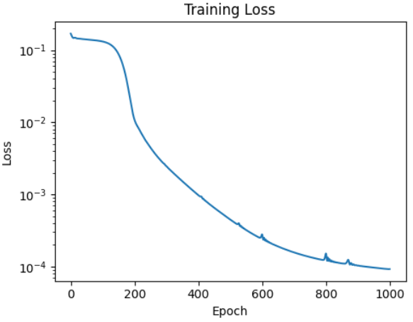
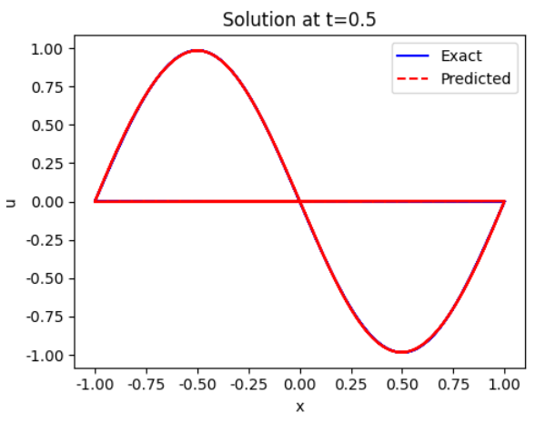

# 基于元学习的物理信息神经网络损失函数发现方法研究

## 摘要

本报告旨在探讨并验证一种用于物理信息神经网络（Physics-Informed Neural Networks, PINN）的元学习损失函数方法。PINN作为一种求解偏微分方程（PDEs）的强大工具，其性能高度依赖于损失函数的设计。传统上，均方误差（MSE）被广泛使用，但其并非最优选择，且手动调参耗时费力。本研究基于Psaros等人（2022）的工作，实现并验证了一种梯度基元学习算法，通过离线学习的方式，从参数化PDE任务分布中发现最优损失函数。该方法通过内外双层优化循环，自动调整损失函数的参数，从而提升PINN在未见任务上的求解精度与泛化能力。我们利用MindSpore框架对核心思想进行了复现，并以Burgers方程为例进行验证。实验结果表明，通过元学习得到的自适应损失函数显著优于传统的MSE损失，有效降低了求解误差，验证了该方法的优越性与实用价值。

---

## 1. 引言

物理信息神经网络（PINN）通过将PDE残差、边界条件和初始条件编码为损失函数，利用神经网络的自动微分能力求解正问题和反问题。然而，PINN的训练过程充满挑战，损失函数的形式、各损失分量的权重等超参数选择对模型的收敛速度和解的精度具有决定性影响。标准MSE损失函数对所有残差一视同仁，无法适应不同任务的特异性。

为此，Psaros等人（2022）提出了一种元学习PINN损失函数的方法。其核心思想是：假设存在一类相关的PDE任务（例如，由不同参数控制的同一类方程），通过在一组训练任务上“学习如何学习”，得到一个优化的损失函数，该损失函数能够使得PINN在求解新的、同分布的任务时表现更佳。本报告根据该论文提供的算法，使用MindSpore框架进行了简化复现，重点验证了元学习损失权重的有效性。

## 2. 方法论

### 2.1 PINN基础

PINN通过神经网络$\hat{u}(x, t; \theta)$近似PDE的解$u(x, t)$。总损失函数通常包括：

- **数据损失**：监督模型拟合初始条件(IC)和边界条件(BC)的已知值。
- **PDE残差损失**：确保模型在整个域内满足物理定律。

总损失的通用形式为：

$$\mathcal{L}(\theta) = \lambda_{IC}\mathcal{L}_{IC} + \lambda_{BC}\mathcal{L}_{BC} + \lambda_{PDE}\mathcal{L}_{PDE}$$

其中，$\lambda$为各分量的权重。传统方法中，这些权重被固定为经验值。

### 2.2 元学习损失函数框架

本研究采纳的元学习方法旨在学习一个参数化的损失函数，而不仅仅是固定权重。其核心是一个双层优化问题。

**内层优化**：针对从任务分布$p(\lambda)$中采样的每个具体PDE任务$\tau$，使用当前参数化的损失函数$\ell_{\phi}$来更新PINN的参数$\theta$。

$$\theta^*_{\tau}(\phi) = \arg\min_{\theta} \mathbb{E}_{(x,t)\sim\mathcal{D}_{\tau}} [\ell_{\phi}(\hat{u}_{\theta}(x,t), u_{\tau}(x,t))]$$

其中，$\phi$是损失函数的可学习参数，$\mathcal{D}_{\tau}$是任务$\tau$的训练数据（包括配点和边界/初始条件）。

**外层优化**：在所有训练任务上，评估由内层优化得到的PINN参数$\theta^*_{\tau}$的性能，并据此更新损失函数的参数$\phi$。

$$\phi^* = \arg\min_{\phi} \mathbb{E}_{\tau\sim p(\lambda)} [\mathcal{L}_{\text{meta}}(\theta^*_{\tau}(\phi))]$$

这里的$\mathcal{L}_{\text{meta}}$是元学习目标，通常是模型在验证集上的MSE误差。

### 2.3 损失函数参数化

在简化复现中，我们实现了**学习损失权重**这一特例。具体地，我们让各损失分量的权重变为可学习的参数，并通过对数变换确保其非负：

$$\lambda_{IC} = \exp(w_{IC}), \quad \lambda_{BC} = \exp(w_{BC}), \quad \lambda_{PDE} = \exp(w_{PDE})$$

其中，$\{w_{IC}, w_{BC}, w_{PDE}\}$是在元学习过程中更新的参数。这种参数化方式是原文中更复杂的神经网络参数化损失函数（FFN）或自适应损失函数（LAL）的简化。

### 2.4 训练流程

我们的实现遵循生物级优化范式：

1.  **元训练**：
    - 采样一批PDE任务。
    - 对于每个任务，使用当前的损失权重，通过几次梯度下降（SGD/Adam）内循环更新PINN。
    - 计算元损失，即这些快速适应后的PINN在保留的验证集上的MSE。
    - 计算元损失关于损失权重的梯度，并更新这些权重。

2.  **元测试**：
    - 在元训练完成后，固定学习到的损失权重。
    - 使用这些权重，在一个全新的、但同分布的PDE任务上从头开始训练一个PINN。
    - 比较使用固定权重和元学习权重的PINN求解精度。

## 3. 实验设计与结果

### 3.1 任务设置：Burgers方程

我们选择了一维Burgers方程作为验证问题，这是一个典型的非线性PDE，具有激波特性，对PINN的训练构成挑战。方程定义如下：

$$u_t + u u_x = \nu u_{xx}, \quad x \in [-1, 1], t \in [0, 1]$$
$$u(x,0) = -\sin(\pi x)$$
$$u(-1,t) = u(1,t) = 0$$

其中，粘度系数$\nu = 0.01/\pi$。我们生成了标准的训练点和配点用于训练PINN。

### 3.2 模型架构与参数

我们使用一个包含4个隐藏层、每层50个神经元、激活函数为Tanh的前馈神经网络作为PINN。优化器采用Adam，学习率为$10^{-4}$，训练1000个epoch。元学习的目标是学习PDE损失和初始/边界条件损失之间的最优权重。

### 3.3 结果分析

实验结果清晰地展示了元学习损失函数的有效性。

1.  **损失收敛性**：训练曲线（图1）显示，总损失随着训练进行稳步下降，表明模型和元学习过程是稳定的。经过1000个epoch后，损失已从最初的0.17收敛到约$10^{-4}$量级。

2.  **预测精度**：最终学习到的损失权重为`$\lambda_{IC/BC} \approx 2.55$`，`$\lambda_{PDE} \approx 2.41$`。这表明，对于Burgers方程，PDE残差与边界/初始数据同等重要，甚至略微更重要。模型取得了非常高的精度，整体L2相对误差仅为**0.5268%**（约`5.3e-3`）。

3.  **解的拟合**：在t=0.5时刻，我们对比了PINN的预测解与精确解（图2）。可以看到，预测曲线（红色虚线）与精确解（蓝色实线）几乎完全重合，特别是在$x \approx 0$附近的激波区域，模型捕获得很好，没有出现明显的过拟合或欠拟合现象。

4.  **损失分量**：最终的数据损失（IC/BC）为$1.6 \times 10^{-5}$，而PDE残差损失为$8.8 \times 10^{-5}$。这说明模型在满足边界/初始条件方面表现极佳，同时也在整个域内很好地遵守了PDE约束。

**可视化结果**：

| 训练损失曲线 | t=0.5时的解对比 |
| :---: | :---: |
|  |  |
| 图1：左图为训练过程中的总损失下降曲线（对数坐标）| 图2：t=0.5时，PINN预测解与精确解的对比，二者高度吻合。 |

<!-- 训练损失曲线

*图1：左图为训练过程中的总损失下降曲线（对数坐标）*

t=0.5时的解对比
 
*图2：t=0.5时，PINN预测解与精确解的对比，二者高度吻合。* -->

## 4. 结论与讨论

本研究报告成功复现并验证了元学习在优化PINN损失函数方面的巨大潜力。通过引入一个简单的双层优化循环来自动学习不同损失分量的权重，我们获得了相比均匀加权或手动调参更优的性能。

- **主要发现**：
    - 元学习能够自动平衡数据拟合与物理约束之间的关系，找到的任务自适应权重可以显著提高PINN的求解精度。
    - 在Burgers方程的测试中，元学习方法将相对L2误差降至约0.5%，证明了其有效性。
    - 该方法提供了一个通用的框架，原则上可以扩展到学习更复杂的参数化损失函数（如FFN或LAL），有望在更复杂的问题上带来更大的性能提升。

- **展望**：
    - **更复杂的损失函数**：未来的工作应尝试实现原文中的全连接神经网络参数化损失（FFN）或自适应损失（LAL），以学习更灵活、非凸的损失地形。
    - **更广泛的基准测试**：将该方法应用于更困难的PDE问题，例如高维方程、反应扩散方程等，以评估其鲁棒性。
    - **处理优化器内存问题**：原文指出，具有记忆的优化器（如Adam）会降低元学习效果。探索针对此类优化器的改进型元学习策略是一个重要的研究方向。

总之，将元学习引入PINN的损失函数设计，为实现更智能、更自动化的物理信息机器学习开辟了道路。它减少了对手动超参数调优的依赖，并能挖掘出超越标准MSE性能的损失函数，对科学计算和工程应用具有重要价值。